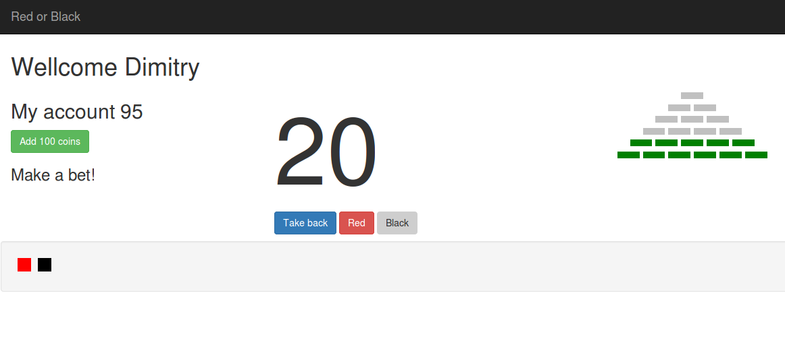

#Red or black game.

##Object of the Game

The player gets 100 virtual coins on his account.

Then he makes an optional bet from 1 to 10 coins that are deducted from his account.

He starts the game trying to guess out the color (red or black).

This colors are generated randomly and showed on the screen.

If the player selected the correct color his bet doubles and he can guess out again or takes the coins back to his account.

If wrong he loses his bet and makes another one until he runs out of money.

Every time when the user guesses out correctly, he doubles his money but no more that 8 times.

After 8-time win user "wins the pyramid" and sees the shape of the pyramid on the screen were every successful attempt is represented as a layer of the pyramid.

So, if he bets 1 coin he wins ((((((((1*2)*2)*2)*2)*2)*2)*2)*2 = 256 coins.

Also, the player has to see the history of the previous attempts.

##Tehnology

Level 1

- jquery

Level 2

- bootstrap
- jquery
- nodejs

Level 3

- bootstrap
- jquery
- nodejs
- angularJS

